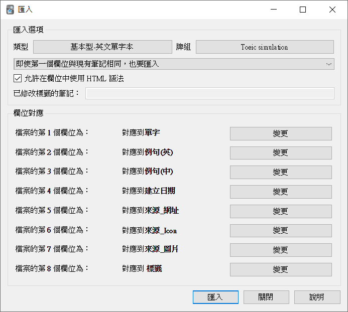

# Saladict Yaml to anki spreadsheet 

記錄我自己使用[沙拉查詞](https://saladict.crimx.com/)的方式，如果你的使用情境與我類似，希望能幫助到你

1. 將沙拉查詞單字本輸出成`.yaml`
2. 運用python腳本轉換成`.xlsx`格式
3. 使用[Anki外掛](https://github.com/HelenFoster/AnkiSpreadsheetImportPlus)讀取檔案並轉成筆記

## 緣起

### 沙拉查詞

沙拉查詞是一款好用的瀏覽器插件，只要選中不熟悉的單字，它會自動擷取單字並顯示網路字典的查詢結果，並且可以快速製作卡片並同步到Anki。

### 沙拉查詞的缺點

如果你想記錄更多的資訊，比如字根字首等，別無選擇只能寫在Note欄位。
[相關討論](https://github.com/crimx/ext-saladict/issues/976)

### 格式化輸出

想改善Note欄位的方式有幾種:
1. 把Note欄位當作html的方式編寫，這樣在自動製卡的時候就可以顯示漂亮的圖片
   - 這樣在每次紀錄生字的時候都需要編寫html，心力不是花費在筆記而是在撰寫html上
   - 筆記的內容依然是固定的，而且生字本會很難閱讀
2. 把Note欄位當作一個csv檔，每個不同欄位透過`,`分隔，將生字本輸出成CSV檔引入
   - `,`本身並無法說明值的內容，容易搞錯值的定義
   - Anki本身載入`.csv`格式會有問題，遇到欄位內容有`\n`時，會無法辨識每筆資料的內容有幾欄。
3. 採用結構化的文本格式輸出，比如`.json`或`.yaml`，將生字本輸出成文字格式，再透過工具轉為anki筆記

這裡我採用第三種方案。

## 相關工具

### genanki

- genanki是一個python Lib，使用者可以透過genanki打包製作出自己的`.apkg`牌組。
- 使用者必須了解Anki內部的資料結構才能操作。

### AnkiConnect

- AnkiConnect是一個Anki的外掛，安裝之後再anki執行時會開啟一個Server，外部的程式可以透過此server即時的與Anki溝通，執行各種操作包含創建牌組與筆記等。
- 封包的格式是簡單的POST命令，實際的命令在body用json格式包裝
- `curl localhost:8765 -X POST -d "{\"action\": \"deckNames\", \"version\": 6}"`
- 與genanki類似，你必須理解API並正確包裝成JSON命令

### CrowdAnki

- CrowdAnki是一個Anki外掛，提供JSON格式的方式匯入/匯出牌組
- JSON格式不易閱讀，不好手動修改牌組內容，通常會選擇載入Anki Desktop再編輯

### Panki

- 建構牌組的外部工具，類似genanki與CrowdAnki等
- 以`json`、`html`等方式定義筆記與卡片模板
- 可以使用`.csv`,`.json`,`.yaml`來管理筆記資料
- 可以讀取`.apkg`轉成panki的專案形式，這樣的好處是我們可以先在anki設計好筆記與卡片，導出`.apkg`後，再經由`.csv`補進資料

### Anki-Cli [2021/8/10]

- 非官方的外部CLI工具
- 支援使用yaml輸入筆記，與本篇試圖做到的事情相同，而且不用額外編輯與處理excel

## 本篇專案的使用方式

1. 安裝Anki外掛[Spreadsheet Import Plus for Anki](https://github.com/HelenFoster/AnkiSpreadsheetImportPlus/tree/v0.1.0)

2. 使用沙拉查詞快速查詢生字的辭義並製作筆記 

3. 將生字本輸出成yaml格式 

4. 使用腳本`yaml2xlsx.py`轉成xlsx試算表 `-i mydict.yaml`

5. 打開轉換好的試算表，根據你的筆記欄位名稱修改試算表欄位名稱 

6. 打開Anki匯入xlsx檔，匯入格式選擇`SpreadSheet Import Plus(.xlsx)`

這樣的流程有幾個好處:
1. 使用`yaml`格式快速紀錄情境與生字，打開沙拉查詞生字本的時候可讀性高
2. 以`yaml`紀錄的生字本，若是偏好其他閃卡服務如Memrise或Quizlet也很好轉換
3. `xlsx`的處理大量筆記比較方便

## Reference

### Relate Anki tools

- [Genanki](https://github.com/kerrickstaley/genanki)

- [CrowdAnki](https://github.com/Stvad/CrowdAnki#snapshots)

- [AnkiConnect](https://github.com/FooSoft/anki-connect#note-actions)

- [Anki CLI](https://github.com/julien-sobczak/anki-cli)

- [Spreadsheet Import Plus for Anki](https://github.com/HelenFoster/AnkiSpreadsheetImportPlus/tree/v0.1.0)

- [Anki Excel sync](https://github.com/BlueGreenMagick/sync-excel-with-anki)

- [panki](https://gitlab.com/x4ku/panki)

### Python Lib in this Article

- [openpyxl](https://openpyxl.readthedocs.io/en/stable/)
